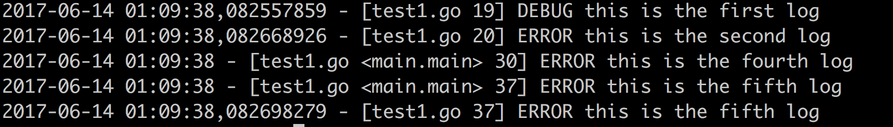

## logging

logging 是一个基于[Go](http://golang.org/)的日志库，类似于**python**的logging库，使用简单，提供丰富的功能。

* 支持全局定义的logger，通过logging.GetLogger(loggerName)可以获取唯一的logger，并且可以给它安装多个handler
* 提供三种不同的handler，日志文件支持按照文件大小和时间切分
* 提供三种不同的logLevel，DEBUG、WARNING、ERROR，可以设置handler的日志级别，高级别的hander会忽略掉低级别的输出
* 支持使用map字典来初始化logger
* 提供丰富的日志格式，可以自由选择组合不同的格式，例如默认的格式  **%(dateTime),%(nanoSecond) - [%(fileName) %(lineNo)] %(levelName) %(message)** 输出信息类似于：
  2017-06-14 00:17:06,693811891 - [test.go 79] your message
    * **name**        logger名称
    * **levelName**   日志级别
    * **pathName**    代码源文件的完整路径
    * **fileName**    代码源文件名称
    * **funcName**    函数名称
    * **lineNo**      输出日志行号
    * **date**        时间格式  2006-01-02
    * **unixTime**    时间戳  1497369315
    * **dateTime**    时间格式 2006-01-02 15:04:05
    * **weekday**     星期几 Tuesday
    * **nanoSecond**  输出日志的纳秒时间
    * **message**     输出的日志信息
    

## install

安装FileLogger使用"go get"命令
    
    go get github.com/y851592226/logging
    
只基于[Go](http://golang.org/)标准库，不依赖第三方库

## Example

下面是BasicHandler 的使用示例，想要了解RotatingHandler 和 TimeRotatingHandler 的使用方法，请参考**example.go**

[](example/example.go)

```go
package main

import "logging"

func main() {
	fileDir := "."
	fileName := "" //空代表将日志发送到标准输出，只有BasicHandler能设置fileName为空
	//获取基础的handler
	//另外两种handler 分别是：
	//    RotatingHandler  按照文件大小来切分日志
	//    TimeRotatingHandler  按照时间来切分日志 可以设置切分间隔 秒(s) 小时(h) 天(d)
	basicHandler, err := logging.GetBasicHandler(fileDir, fileName)
	if err != nil {
		panic(err.Error())
	}
	// handler.Close()在整个程序中只需要调用一次，调用之后，handler打开的文件  
	// 将会被关闭，再次向handler中写入会无法得到输出 
	// logger.Close()可以一次关闭所有安装在该logger上面的handler
	defer basicHandler.Close()
	log := logging.GetLogger("logName")
	log.AddHandler(basicHandler)
	log.Debug("%s", "this is the first log")
	log.Error("%s", "this is the second log")
	//设置输出的日志格式
	err = basicHandler.SetFormatString("%(dateTime) - [%(fileName) <%(funcName)> %(lineNo)] %(levelName) %(message)")
	if err != nil {
		panic(err.Error())
	}
	//设置输出的日志级别 低于ERROR的日志不会被输出
	basicHandler.SetLogLevel(logging.ERROR)
	//该条日志不会被输出
	log.Warning("%s", "this is the third log")
	log.Error("%s", "this is the fourth log")
	basicHandler2, err := logging.GetBasicHandler(fileDir, fileName)
	if err != nil {
		panic(err.Error())
	}
	log.AddHandler(basicHandler2)
	//这条日志会被输出两次，因为安装了两个hander
	log.Error("%s", "this is the fifth log")
}

```

## FAQ

如果使用过程中遇到任何问题，希望主动与我(851592226@qq.com)联系，也可提交[Issues](https://github.com/y851592226/logging/issues)，我会及时解决和回复


## License


FileLogger基于 [Apache License, Version 2.0](http://www.apache.org/licenses/LICENSE-2.0.html).